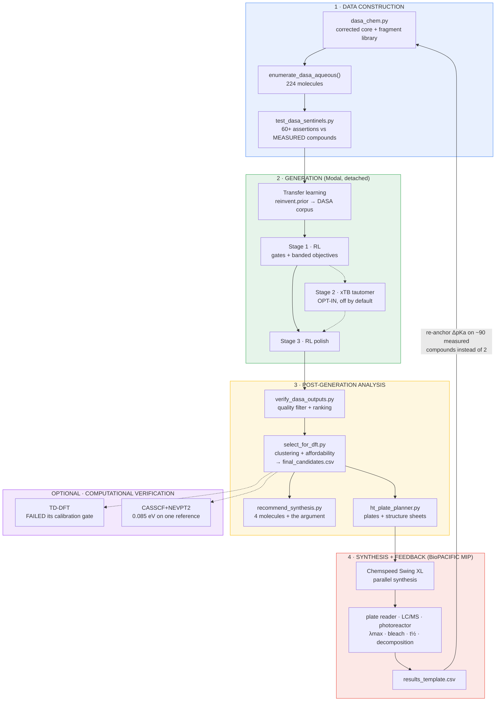

# Water-switchable DASA discovery

**Start here.** This is the single document for the DASA project. (`README.md` is
upstream REINVENT4's; everything specific to this work is here.)

Generative design of donor–acceptor Stenhouse adducts that are **visible, switchable,
and reversible in water** — a combination with no literature precedent.

---

## Contents

1. [The goal and why it is hard](#1-the-goal-and-why-it-is-hard)
2. [The pipeline](#2-the-pipeline)
3. [Chemistry: the core, and the error that invalidated eight months](#3-chemistry)
4. [Data construction](#4-data-construction)
5. [Generation](#5-generation)
6. [Scoring — every formula, its source, its calibration](#6-scoring)
7. [Post-generation analysis](#7-post-generation-analysis)
8. [Computational verification: what worked, what failed](#8-computational-verification)
9. [High-throughput synthesis and the feedback loop](#9-high-throughput-synthesis)
10. [Runbook](#10-runbook)
11. [Collapse modes and standing design rules](#11-collapse-modes)
12. [Honest limitations](#12-honest-limitations)
13. [References](#13-references)

---

## 1. The goal and why it is hard

A DASA is a negative photoswitch: a coloured, linear **open** triene that photocyclises
to a colourless **closed** cyclopentenone and thermally reverts.

Water is very polar, and the closed form of a first-generation DASA is a **zwitterion**
(ammonium + acceptor enolate). Water stabilises it and locks the switch closed —
"dark switching". Pure-water reversible switching **has never been achieved**; the
literature reaches it only via cosolvent or cyclodextrin encapsulation [3].

So the same molecule must be **open-favoured in water AND visible AND soluble AND
reversible** — a conjunctive objective, enforced with a `geometric_mean` score so a low
value on any single axis sinks the molecule. It can only reward the intersection.

---

## 2. The pipeline



**One source of truth.** `select_for_dft.py` writes `final_candidates.csv`; both
`recommend_synthesis.py` and `ht_plate_planner.py` read it, so a plate and a
recommendation can never disagree.

---

## 3. Chemistry

### The open form

```
R₂N–Cₐ(H)=C_b(H)–C_c(H)=C_d(OH)–C_e(H)=C_f(acceptor)        configuration (2Z,4E)
```

The hydroxyl sits on **C2** — the former furan oxygen — with a methine bridging to the
acceptor.

### The error that invalidated everything before 2026-07-28

The corpus encoded **R₂N-CH=CH-CH=CH-C(OH)=Acceptor**: hydroxyl on the carbon bonded
to the acceptor. Same molecular formula, same bond alternation — a **constitutional
isomer**, which is why no internal check caught it for months.

Four independent confirmations of the correct structure:

1. The Organic Syntheses title name — a *checked* procedure by Read de Alaniz:
   `5-((2Z,4E)-5-(diethylamino)-2-hydroxypenta-2,4-dien-1-ylidene)-2,2-dimethyl-1,3-dioxane-4,6-dione` [1]
2. Mechanism: the amine opens furfurylidene at furan-C5, so the furan oxygen stays on
   former furan-C2, adjacent to the Knoevenagel methine
3. Chem Soc Rev 2023: *"hydroxy-functional group in C2 position"* [3]
4. ¹H NMR of OrgSyn compound 2: exactly **one** vinyl triplet. Our connectivity
   (4 consecutive CH) requires **two**

It computed **229 nm** blue of the measured anchor. Guards now in place:
`is_legacy_core()` detects it, `legacy_to_corrected()` converts old structures, and the
sentinel suite asserts measured literature DASAs parse as DASAs — the check whose
absence hid it.

### The closed form

Thermally allowed conrotatory 4π-electrocyclization forms the Cₐ–C_e σ bond, giving a
**4,5-disubstituted cyclopentenone** [3]. The enol OH becomes the ring ketone and its
proton transfers:

- **to N** → zwitterion (**ammonium** R₃N⁺–H + acceptor enolate) — polar, water-locked
- **to C_f** → neutral keto — escapes the trap

Both are open to any amine, since the proton comes from the enol rather than from N.
Which wins is set by **amine basicity**. Chem Sci 2018 X-ray confirms it: 1b/2b/9b
(alkyl donors) are zwitterionic enolates with a *protonated amine*; 14b′ (aniline) is
the keto form [2].

---

## 4. Data construction

`notebooks/dasa_chem.py` — the canonical chemistry library. Core SMARTS, donor/acceptor
classification, the fragment library, `open_to_closed` / `open_to_closed_keto`,
`planar_conformer`, `dasa_retrosynthesis`, `legacy_to_corrected`.

`enumerate_dasa_aqueous()` builds **224 molecules** as donor × backbone × acceptor.
Donors span two independent axes:

- **basicity** — aryl vs alkyl N — decides zwitterion vs keto
- **rigidity** — N locked in a ring — raises the barrier, resists hydrolysis, keeps the
  chromophore planar

**Indoline is both**, and it is a measured 615 nm DASA [4]. Treating "aniline" and
"tethered" as disjoint families was an enumeration artefact; `is_rigid_donor()` and
`donor_axes()` report them separately.

`notebooks/test_dasa_sentinels.py` — **60+ assertions, 2.4 s**, run before every
campaign. Asserts measured literature DASAs parse as DASAs, decoys and the legacy
skeleton are rejected, closed forms are ammonium cyclopentenones, both donor axes are
correct, the colour gate rejects acylated/N–O donors, and the corpus is clean.

---

## 5. Generation

REINVENT4 transfer learning on the corpus, then staged RL.

| stage | steps | what it adds |
|---|---|---|
| TL | 50 ep | fine-tune `reinvent.prior` on the DASA corpus |
| Stage 1 | 500 | all gates + banded objectives (cheap, no 3D) |
| Stage 2 | 30–40 | xTB tautomer preference — **opt-in, off by default** |
| Stage 3 | 400 | polish |

The corpus is written **stereo-free** (the prior's vocabulary cannot tokenise stereo).
This is safe: the connectivity fix lives in the SMILES, and 224/224 keep the corrected
core after stripping. Stereochemistry is a geometry question, restored at verification
by `assign_literature_stereo()`.

**Diversity filter:** `ScaffoldSimilarity`, `minsimilarity = 0.8`, `bucket_size = 400`.
Sizing matters as much as the axis — see [collapse modes](#11-collapse-modes).

---

## 6. Scoring

Two tiers, and the distinction is load-bearing:

- **GATE** — hard requirement, 0/1, **no gradient**. Can only exclude, so it can never
  become something the generator optimises *toward*.
- **BAND** — has a window, double sigmoid, **interior optimum**. Reward falls off on
  *both* sides, so the objective cannot run away.

| term | type | weight | source |
|---|---|---|---|
| `DASAScaffold` | gate | 1.0 | corrected core SMARTS [1][3] |
| `DASAColor` | gate | 1.0 | acceptor with a measured DASA λmax; donor not acylated/N–O |
| `DASAIntegrity` | gate | 1.0 | π system continuous, chain planar-capable |
| `custom_alerts` | gate | 1.0 | decomposition SMARTS |
| `DASATrapEscape` | **band** | 0.6 | ΔpKa — below |
| `AqueousSolubility` | **band** | 0.5 | logS/logP window |
| `SA` | soft | 0.4 | RDKit synthetic accessibility |
| diversity filter | penalty | — | `ScaffoldSimilarity`, atom-pair Tanimoto |

### 6.1 ΔpKa — the push–pull / trap coordinate

```
ΔpKa = pKa(amine conjugate acid) − pKa(carbon acid)
```

**Why this formula.** Ring closure is a proton transfer, so the pKa *difference* is the
physical variable. Large positive → the amine takes the proton → zwitterion →
water-locked. Near zero or negative → neutral keto → escapes.

**Literature basis.** Peterson / Read de Alaniz's ionic-character study [5]: first- and
third-generation architectures show higher zwitterionic resonance contribution *and* a
zwitterionic closed form, while second-generation (aryl donor) has a less
charge-separated open form and a **neutral** closed form.

**Computation.** Amine pKaH = class base + Hammett (slope 2.89 on Σσ) + aza-ring
correction. Carbon-acid pKa from literature, with an EWG correction **scoped to the
acceptor ring** (unscoped, a CF₃ on the *donor* ring was being counted as acceptor pull).

**Implied solvent: water** — every pKa in the table is aqueous, which is the target.

**Calibration** — reproduces the measured generation ordering:

| compound | ΔpKa | behaviour |
|---|---|---|
| Me₂N / CF₃-pyrazolone | +7.20 | 3rd-gen, trapped |
| Me₂N / barbituric | +6.69 | 1st-gen, trapped [2] |
| 4-MeO-aniline / barbituric | +1.37 | 2nd-gen, switches [2] |
| indoline / barbituric | +0.89 | 2nd-gen, switches [4] |
| aminotriazine / barbituric | −4.51 | donor too weak |

**Band [0.0, 3.5], asymmetric:** `w_hi = 0.8` (firm — we have measured trapped compounds
there) and `w_lo = 2.5` (gentle — we do *not* know how weak a donor can get before
colour dies, so it disfavours without banning). Normalised so the plateau is 1.0.

**Resolution.** The previous 3-bin version returned an identical 0.836 for every aryl
donor; ΔpKa spans **3.03 pKa units** across the same set. That flatness is what let
solubility become the sole gradient and drive the donors to azoles.

### 6.2 λmax — transferred from measurement, not computed

λmax is set by the **acceptor**, nearly independently of the donor. Chem Sci 2018
measured 13 barbituric DASAs spanning Me/Me → Oct/Oct → pyrrolidine → THIQ: all
**567 ± 3 nm** [2]. Aryl donor → 588 [2]; indoline → 615 [4].

That ±3 nm empirical statement is **tighter than any calculation we can afford**:

| method | error on DASAs | source |
|---|---|---|
| TD-DFT (B3LYP, DFT geometry) | 0.44 eV | [6] |
| our TD-DFT | ~0.69 eV, gate **FAILED** | this repo |
| NEVPT2 CAS(10,10) | **0.085 eV** (one reference, gas phase) | this repo |
| CASPT2 | 0.06 eV | [6] |
| DLPNO-STEOM-CCSD | 0.049 eV MAE | [7] |

TD-DFT gives the DASA S₁ *"almost null charge-transfer character"* [6] — it cannot see
the charge transfer, which is why it also returns near-zero solvatochromic slopes for
compounds that are strongly negatively solvatochromic.

### 6.3 Thermal reversion — deliberately NOT scored

Eyring on the 14 measured half-lives [2]:

| compound | t½ | ΔG‡ |
|---|---|---|
| Pr/Pr | 6 s | 18.73 kcal/mol |
| Me/Me | 32 s | 19.72 |
| 4-MeO-aniline | 265 s | 20.98 |

**Spread across all 14 donors: 2.24 kcal/mol** — smaller than the error bar of any
method cheap enough for an RL loop (DFT 2–4, xTB 3–6 kcal/mol). Scoring it would inject
noise as a gradient, the exact mechanism behind every collapse below. It belongs in the
lab, where a plate reader measures t½ directly.

---

## 7. Post-generation analysis

| script | writes | purpose |
|---|---|---|
| `verify_dasa_outputs.py` | `verified_candidates.csv` | quality filter, saturation warnings, ranking |
| `select_for_dft.py` | `final_candidates.csv` + PNGs | Butina clustering, donor-axis flags, **DFT affordability** |
| `recommend_synthesis.py` | `SYNTHESIS_RECOMMENDATION.md` | 4 molecules with the argument for each |
| `ht_plate_planner.py` | plate files + **structure sheets** | plates for automated synthesis |

**Affordability** is screened *before* any container spawns: heavy-atom count after
chromophore truncation. Truncation cuts 38-heavy candidates to 20–26 — reference-sized.

**Synthesis recommendations** rest on three legs, none of which is a computed λ:
literature transfer for colour, ΔpKa placement against measured switchers, and a
**retrosynthesis** — every DASA is two steps from furfural [1], so each candidate splits
into two named precursors. Validated: it recovers dimethylamine + 1,3-dimethylbarbituric
acid, diethylamine + Meldrum's acid, indoline + 1,3-dimethylbarbituric acid.

---

## 8. Computational verification

### What failed

**TD-DFT.** Reference λ errors −131 and −173 nm, spread 41.6 nm — the calibration gate
failed. Solvatochromic slopes came out *positive* for all six molecules including both
measured references, when DASAs are negatively solvatochromic. Consistent with [6].

### What worked

**NEVPT2** (`nevpt2_verify.py`, `modal_nevpt2.py`). CASSCF(10,10) + NEVPT2 with an
**auditable active space**: rotate so the chain plane is xy, measure each frontier
orbital's π character on conjugated p_z AOs, fix the space size, print every orbital
with its π fraction. NatComm-10 came in at **0.085 eV** — better than the published
NEVPT2 benchmark of 0.15 eV [6], at 6-31G where the benchmark used cc-pVDZ.

ChemSci-1 missed at 0.264 eV, and the diagnostics explain it: **40.5° chain twist,
worst-π 0.217**. A Modal/local RDKit version difference produced a twisted conformer;
locally the same input gives 4.5°. The auditable active space flagged its own
unreliability rather than returning a plausible number. A twisted chromophore now
aborts.

---

## 9. High-throughput synthesis

**BioPACIFIC MIP (UCSB)** [9]. Chemspeed Swing XL with **photochemical**, high-pressure
and jacketed-cooled reactor arrays, −20 to 180 °C; UHPLC/triple-quad MS, HPLC-UV-Vis,
plate reader with fluid injection, in-line FTIR/NMR. **Free with an approved proposal.**
Read de Alaniz — who invented DASAs — is MIP faculty.

That stack measures directly everything we struggled to compute: λmax (±1 nm, seconds),
switching (photoreactor + bleach), t½ (plate-reader kinetics), decomposition (LC/MS).

### Why DASAs suit plates

```
step 1  (BULK, one prep per acceptor)   furfural + carbon acid → furfurylidene
step 2  (PARALLEL, one per well)        furfurylidene + amine  → DASA
```

A plate is one bulk intermediate plus N pipetted amines, so the binding constraint is
**whether the amine is purchasable**. We therefore rank **plates**, not molecules.

### Not 96 lookalikes

1. **Acceptor fixed per plate** (that is what makes it cheap) — and since λmax is
   acceptor-set, colour is not a useful within-plate variable.
2. **ΔpKa is the within-plate variable**, stratified with round-robin selection across
   strata. Best-first would pile every well into one bin — one experiment repeated 96
   times. Achieved: **2.48 ΔpKa units across 6 strata**.
3. **Amines must be structurally distinct** — minimum pairwise Tanimoto on the *amine*.
   Achieved: 39/39 and 25/25 unique.

**Plates come back partly empty on purpose** (43/96, 29/96). That means we ran out of
genuinely distinct chemistry at threshold 0.55, not that the plate is underpacked.

### On-plate controls

Every plate carries four measured compounds made through the same chemistry in the same
run — ChemSci-1 (567 nm, t½ 32 s), ChemSci-14 (588 nm, 265 s), NatComm-10 (615 nm), and
pyrrolidine as a **negative** control that should *decompose* rather than revert [2].
If the controls miss, the **plate** failed — not the candidates.

### Outputs

`plate_map.csv`, `worklist.csv` (liquid-handler input), `intermediates.csv`,
`amine_order_list.csv`, `plate_summary.csv`, `results_template.csv`, and
**`<plate>_structures.png`** — every well drawn, controls labelled with expected λmax
and t½, generated automatically on every run.

### Rollout

1. **Proposal** to `info@biopacificmip.org`. Lead with autonomous experimentation —
   NSF's 2025 renewal funds robotics + AI for closed-loop discovery.
2. **Confirm chemistry with staff before ordering** — step-2 solvent/temperature/time,
   whether the photochemical array can run the switching assay in-plate.
3. **Source** ~61 amines for two plates. Every entry needs a real catalogue check.
4. **Run one plate; read the controls first.** If they miss, stop.
5. **Measure** formation (LC/MS), λmax, bleach %, t½, decomposition.
6. **Feed back** via `results_template.csv`. The prize is not the hit list — it is that
   ΔpKa becomes anchored on ~90 measured compounds instead of 2, and acceptor→λmax gets
   real error bars.
7. **Regenerate** and plate again.

---

## 10. Runbook

**Modal is for jobs over ~15 minutes** (RL, TD-DFT, NEVPT2). Everything else is local
and runs in seconds.

```bash
python notebooks/test_dasa_sentinels.py                    # 3 s pre-flight, ALWAYS
modal volume rm -r dasa-outputs outputs_dasa               # clear stale state
modal run --detach modal_dasa.py --xtb-workers 16          # generate
modal volume get --force dasa-outputs outputs_dasa outputs_dasa_modal
python notebooks/verify_dasa_outputs.py --dir outputs_dasa_modal/outputs_dasa --save-top 300
python notebooks/select_for_dft.py                         # → final_candidates.csv
python notebooks/recommend_synthesis.py --n 4
python notebooks/ht_plate_planner.py --plates 2            # plates + structure sheets
```

Do **not** pass `--resume` (the legacy-checkpoint guard aborts it) or `--stage2` (xTB is
opt-in). Detached apps survive closing the laptop; `detached_disconnected` is just what
`detached` becomes once the client drops.

**Health check while generating:** the Stage-1 DASA gate pass rate. Above ~50% is
healthy; single digits means the diversity filter is choking the target class.

Superseded scripts are in `archive/` with a README. All were written against the
pre-fix core and describe the wrong molecule.

---

## 11. Collapse modes

Every reward hack was **one objective becoming the sole gradient**:

| collapse | sole gradient | fix |
|---|---|---|
| pyrazolidinedione, 94% of output | trap (colour was binary) | evidence-tiered acceptor gate |
| acylated donor (UV) | trap + solubility (colour ignored the donor) | `has_visible_donor` |
| floppy hydrophilic tails | solubility (unbounded) | double-sigmoid band |
| azole-donor drift | solubility (trap saturated at 3 bins) | continuous ΔpKa |
| generator left the scaffold entirely | diversity filter over-tightened | bucket 400, minsim 0.8 |

**Standing rules.**

1. Hard requirement → **gate** (no gradient, can only exclude).
2. Has a window → **band** (interior optimum, cannot run away).
3. A band is **flat inside** — a satisfied constraint stops pushing. When all bands are
   satisfied the only remaining objective is **diversity**.
4. Never let one objective be the sole gradient.
5. Don't shrink the search space to fix a broken function — **fix the function**.
   Domain and precedent belong in verification, not in the RL gate.

---

## 12. Honest limitations

- **Pure-water switching is unprecedented.** These candidates target the window; nothing
  guarantees it.
- **ΔpKa is an estimate.** Its aza-heteroaryl corrections are the least certain values
  in it — and that is exactly the region a run drifted into.
- **ΔpKa's switchable end is anchored on compounds measured in CHCl₃/CH₂Cl₂**, not
  water. The coordinate is anchored by *structure* (the X-ray tautomer split), not by
  water kinetics.
- **No candidate has a measured λmax.** Colour rests on literature transfer.
- **Amine buyability is a heuristic**, not a catalogue query.
- **`furfurylidene()` constructs the intermediate** structurally rather than predicting
  the Knoevenagel product — verify each against the literature prep.
- **Tethered-donor candidates cannot be plated.** Their donor N–C bond is endocyclic, so
  there is no 2-step route; the planner drops them with a reason.
- **Plate volumes and conditions are placeholders** pending facility input.

---

## 13. References

1. Stricker, Peterson, Read de Alaniz. *Preparation of a Donor-Acceptor Stenhouse Adduct
   (DASA).* **Org. Synth.** 2022, 99, 79–91. [10.15227/orgsyn.99.0079](https://doi.org/10.15227/orgsyn.99.0079)
   — the checked 2-step route; the title name settles the C2-hydroxyl connectivity.
2. *Structure–function relationships of donor–acceptor Stenhouse adduct photochromic
   switches.* **Chem. Sci.** 2018, 9, 8242–8252. [10.1039/C8SC03218A](https://doi.org/10.1039/C8SC03218A)
   — 14 compounds: λmax 567 ± 3 nm, dark equilibria, thermal half-lives, closed-form X-rays.
3. *Visible light-responsive materials: DASAs in polymer science.* **Chem. Soc. Rev.**
   2023. [10.1039/D3CS00508A](https://doi.org/10.1039/D3CS00508A) — C2 hydroxyl,
   4,5-disubstituted cyclopentenone, generations, indandione non-photochromic.
4. *Development and characterization of amino donor-acceptor Stenhouse adducts.*
   **Nat. Commun.** 2024, 15. [10.1038/s41467-024-49808-7](https://doi.org/10.1038/s41467-024-49808-7)
   — hydroxy parents at 573/615/646 nm. **Its 531/578/608 values are AMINO DASAs, a
   different chromophore — never calibrate on them.**
5. *Donor-Acceptor Stenhouse Adducts: Exploring the Effects of Ionic Character.* 2020.
   [PubMed 33348446](https://pubmed.ncbi.nlm.nih.gov/33348446/) — the zwitterionic vs
   neutral closed-form split that ΔpKa encodes.
6. *Level of Theory and Solvent Effects on DASA Absorption Properties: TD-DFT, CASPT2,
   NEVPT2.* [PMC5615680](https://pmc.ncbi.nlm.nih.gov/articles/PMC5615680/) — TD-DFT
   0.44 eV, NEVPT2 0.15 eV, CASPT2 0.06 eV; "almost null charge-transfer character".
7. Berraud-Pache *et al.* *Redesigning DASA photoswitches.* **Chem. Sci.** 2021.
   [10.1039/d0sc06575g](https://doi.org/10.1039/d0sc06575g) — DLPNO-STEOM-CCSD, MAE 0.049 eV.
8. Helmy *et al.* *Design and synthesis of DASAs.* **J. Org. Chem.** 2014, 79, 11316.
   [10.1021/jo502206g](https://doi.org/10.1021/jo502206g) — the founding paper.
9. **NSF BioPACIFIC MIP** (DMR-2445868), UCSB/UCLA. [biopacificmip.org](https://biopacificmip.org)
   — Chemspeed Swing XL, automated characterization; free with an approved proposal.
